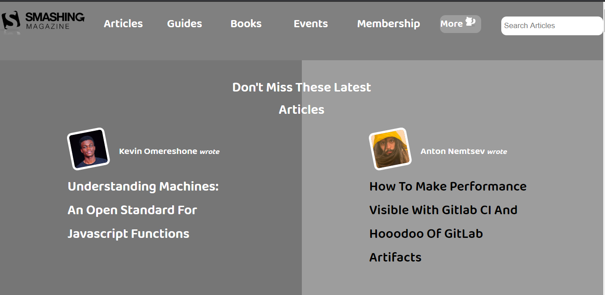

# Design Teardown

The goal is to building a heatmap of the Smashing magazine website. 

## Built With

- HTML and CSS

## Live Demo

[Live Demo Link](https://rawcdn.githack.com/mimipeshy/design_teardown/9b418eed0333c673a3d93435918f11c9d4950829/index.html)

## Getting Started

To get a local copy up and running follow these simple example steps.

### Prerequisites

Install `git` on your local machine

### Setup

Type `git init` in your local terminal

### Install

Clone the repository to your local machine `git clonehttps://github.com/mimipeshy/design_teardown.git ` 

### Usage

Cd into the repository `cd design_teardown`

Open the `index.html` file and run it with any browser of your choice

## Authors

👤 **Mimi Peshy**

- Github: [@githubhandle](https://github.com/mimipeshy)
- LinkedIn: [@linkedinhandle](https://www.linkedin.com/in/peris-ndanu-405083193/)
-Twitter :[@twitterhandle](https://twitter.com/pygirl254)

👤 **Luis Felipe Angulo Torres**

- Github: [@githubhandle](https://github.com/pipe2442)
- LinkedIn: [@linkedinhandle](https://www.linkedin.com/in/luis-felipe-angulo-torres-95098b139/)
-Twitter: [@twitterhandle](https://twitter.com/pipe2442)

## 🤝 Contributing

Contributions, issues and feature requests are welcome!

Feel free to check the [issues page](issues/).

## Show your support

Give a ⭐️ if you like this project!

## Acknowledgments

- Hat tip to anyone whose code was used
- Inspiration
- etc

## 📝 License

This project is [MIT](lic.url) licensed.
